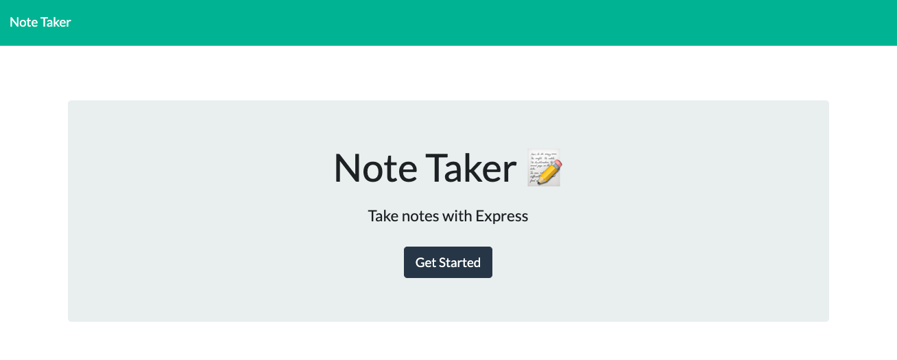
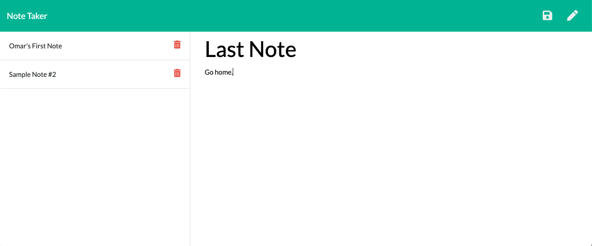
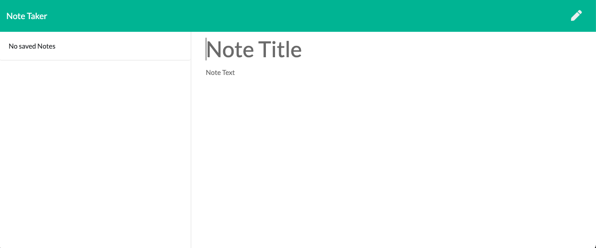

# Note-Taker 

## Table of Contents
* [Description](#description)
* [Visuals](#visuals)
* [Demo](#demo)
* [Installation](#installation)
* [Usage](#usage)
* [Contributors](#contributors)
* [License](#license)
* [Tests](#tests)
* [Questions](#questions)

## Description
This app is intended to help the user take notes, save them, retrieve them and delete one or more saved notes. 

## Visuals
Demo

Homepage

Note Draft

Blank Note

## Demo
[Click here](https://drive.google.com/file/d/1oMx5Yt_DCFxAMLMh1-LkO5jMN7HJcD7l/view) to see a demo of how this tool works

## Installation 
npm install to install express 

## Usage 
The user for this app is someone who needs to take notes and that wants to be able to delete them as the taks or reminders are completed. When the user opens the homepage, they can click "Get Started" to start note taking. The app has an edit and save button that will allow the user to save and edit the notes. 

## Contributors
Omar Cossio

## License
This project is under ISC license

## Tests
No test available

## Questions
Feel free to reach out on [Github](https://github.com/omarcossio/note-taker) or [email](mailto:omar119mce@gmail.com). You can check the deployed [Note-Taker](https://nameless-hamlet-35007.herokuapp.com/) on Heroku.